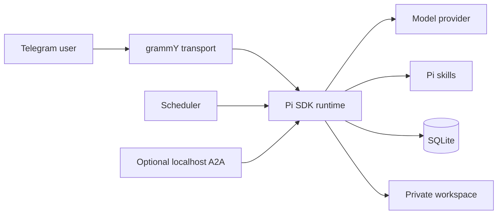

# Furby Open

**A small, self-hosted personal AI agent for Telegram, powered by the Pi SDK.**

Furby Open keeps the core understandable: one Telegram bot, one local SQLite database, Pi-native model access and sessions, a private file workspace, and one always-capable assistant confined to its project by default.

> **Alpha software:** review the security model before giving any AI agent access to your computer.

## Why Furby Open?

- **Small core:** inspectable TypeScript instead of a large agent platform.
- **Local ownership:** memories, schedules, sessions, and uploaded files stay on your machine.
- **Bring your own model:** use Pi-supported OAuth providers or API keys.
- **Telegram-native:** talk to your assistant from a phone without hosting a web UI.
- **Expandable:** add ordinary Pi skills under `.pi/skills/`; the assistant can help author and validate them with project-confined file tools.
- **Safe public defaults:** project-confined file access, no host shell, and no A2A listener until you enable it.

## Features

- Pi SDK runtime, auth/model registry, and native sessions
- Single-user Telegram authorization
- Local SQLite memories, preferences, uploads, and scheduled tasks
- Text, photo, document, PDF, and voice-note ingestion
- Local Whisper transcription or optional OpenAI transcription
- Private workspace with path and symlink confinement
- Rapid-message batching and reliable chunked Telegram delivery
- Persistent project/outside access scopes with native Telegram controls
- Optional localhost A2A JSON-RPC endpoint
- Project-local starter skills for customization and skill creation
- Cross-platform guided installer and private first-run setup
- Health checks, retention cleanup, tests, and PM2 configuration

## Dependencies

All JavaScript dependencies are declared in `package.json` and reproducibly locked in `package-lock.json`; `npm install` or `npm ci` installs them. Furby Open does not vendor model credentials or operating-system packages.

The core text assistant requires Node.js 22.19+ and npm. The guided installers can add them. `ffmpeg` enables voice/media conversion and Poppler's `pdftotext` enables PDF extraction; both are optional for text chat. Local Whisper build tools and PM2 are also optional. Run `bash scripts/check-system-deps.sh` or `npm run doctor` for exact detection.

## Guided Installer

The installer opens one guided terminal flow for dependencies, personality, Telegram, Pi model login, and validation. It pauses whenever you must use BotFather or a provider login, hides the Telegram token, keeps the assistant stopped until setup is complete, and can be rerun safely.

### macOS — double-click

1. Download and unzip the [macOS/Linux installer bundle](https://github.com/bcain2121/furby-open/releases/download/v0.2.0-alpha.1/Furby-Open-Installer-macOS-Linux.zip).
2. Double-click **`Install-Furby-Open.command`**.
3. If macOS blocks it, Control-click it, choose **Open**, then confirm **Open**.

### Windows — double-click

1. Download and unzip the [Windows installer bundle](https://github.com/bcain2121/furby-open/releases/download/v0.2.0-alpha.1/Furby-Open-Installer-Windows.zip).
2. Double-click **`Install-Furby-Open.cmd`**.
3. Approve Windows Package Manager prompts when you want the installer to add Git, Node.js, or FFmpeg.

### Linux or terminal installation

Download the installer, optionally inspect it, then run it:

```bash
curl -fL https://raw.githubusercontent.com/bcain2121/furby-open/v0.2.0-alpha.1/install.sh -o install-furby-open.sh
less install-furby-open.sh
bash install-furby-open.sh
```

It installs into `~/FurbyOpen` by default. On macOS/Linux, a missing Node.js can be installed privately under `~/.local/` with an official checksum-verified Node archive. Linux system packages are installed only after confirmation. See [`docs/INSTALLER.md`](docs/INSTALLER.md) for Windows PowerShell, custom locations, troubleshooting, and exactly what the installer changes.

### Manual installation

```bash
git clone https://github.com/bcain2121/furby-open.git
cd furby-open
bash scripts/bootstrap.sh
npm run setup
```

The shared `npm run setup` wizard handles private personality, Telegram, Pi authentication guidance, and validation on macOS, Windows, and Linux. See [`docs/SETUP.md`](docs/SETUP.md) for the complete manual walkthrough.

### Install with a coding agent

Point an agent with terminal access at the repository and use:

> Install Furby Open from https://github.com/bcain2121/furby-open. After cloning, read `AGENTS.md` and follow `docs/INSTALL_WITH_AI.md` stage by stage. Assume I am nontechnical: perform safe terminal work yourself, explain the exact Telegram BotFather and Pi `/login` actions, pause for me at authentication steps, help me choose the assistant's personality, never ask me to paste secrets into chat, validate everything, and ask before starting the bot.

Codex reads `AGENTS.md`; Claude Code is pointed to the same runbook by `CLAUDE.md`. The agent should own dependency installation and diagnostics while the user completes provider and Telegram authentication locally. A web-only chatbot without terminal access can guide the process but cannot install software on the computer.

## Access Scopes

Furby Open starts in persistent **project scope**. All ordinary assistant capabilities are available, including confined project `read`, `edit`, and `write`; host Bash and paths outside the canonical Furby Open root are unavailable.

```text
/access     Show the current scope
/outside    Immediately enable persistent host filesystem and shell access
/project    Return to project-confined access
```

`/outside` takes effect without a second challenge and persists across sessions, updates, and restarts. Its response warns that the model and scheduled tasks can use OS-account-accessible files and host shell commands until `/project` is sent. Project scope intentionally permits `.env` and related project configuration, so secret-disclosure rules still apply. Read [`SECURITY.md`](SECURITY.md) first.

## Extending the Assistant

Project-local Pi skills live in:

```text
.pi/skills/<skill-name>/SKILL.md
```

The repository includes:

- `assistant-customizer` — safely personalize identity and behavior
- `skill-builder` — design, implement, and validate a new local skill

In project scope, you can ask:

> Create a project-local Pi skill that helps me summarize my weekly notes. Show me the files and validation before using it.

Personal identity values live in ignored `.env`. Private tone and behavioral preferences can live in ignored `.data/personality.md`, which is loaded after the neutral public persona. The bundled customizer can interview the owner and prepare this file without changing public defaults.

See [`docs/CUSTOMIZATION.md`](docs/CUSTOMIZATION.md) and [`docs/EXTENDING.md`](docs/EXTENDING.md).

### Import compatible Codex or Claude Code skills

Furby Open can detect Codex CLI, Claude Code, and standard personal skill directories:

```bash
npm run skills:import -- --list
npm run skills:import
```

The importer accepts compatible `SKILL.md` packages only after confirmation, rejects symlinked or oversized skill trees, warns about Claude-specific features, and never imports hidden Codex system skills. Imported skills are local and Git-ignored. They may contain scripts or powerful instructions, so review them before use.

For agent-driven setup, the installer is instructed to preview candidates and ask before importing anything.

## Updating safely

Check for a newer tagged release without changing the installation:

```bash
bash scripts/update.sh --check
```

Apply it:

```bash
bash scripts/update.sh --apply
```

The updater validates the release in an isolated worktree, backs up private data outside the repository, allows only a clean fast-forward update, reinstalls locked dependencies, and reruns build, tests, and doctor checks. See [`docs/OPERATIONS.md`](docs/OPERATIONS.md).

## Architecture



More detail: [`docs/ARCHITECTURE.md`](docs/ARCHITECTURE.md). For a file-by-file source map, see [`tree.md`](tree.md). The prioritized maturity plan is in [`docs/ROADMAP.md`](docs/ROADMAP.md). The implemented project/outside security model and its acceptance criteria are recorded in [`plan.md`](plan.md).

## Private Data

The repository intentionally excludes:

- `.env` and API credentials
- SQLite databases
- Pi sessions
- Telegram uploads and generated workspace files
- logs
- Pi OAuth files and user-installed global skills

Never commit those files. See [`docs/PRIVACY.md`](docs/PRIVACY.md).

## Development

```bash
npm install
npm run check:public
npm run build
npm test
npm run test:coverage
npm audit --omit=dev --audit-level=critical
```

Contributions are welcome; see [`CONTRIBUTING.md`](CONTRIBUTING.md).

## License

MIT — see [`LICENSE`](LICENSE).

## Name and Affiliation

This independent open-source project is not affiliated with, endorsed by, or sponsored by Hasbro. “Furby” is a trademark of Hasbro and is used here only as the current community project name. A future rename may occur to avoid confusion.
