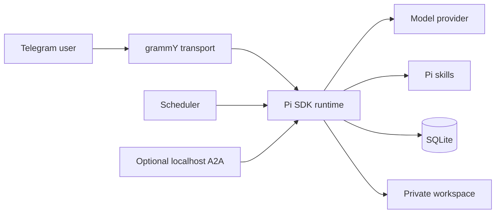

# Furby Open

**A small, self-hosted personal AI agent for Telegram, powered by the Pi SDK.**

Furby Open keeps the core understandable: one Telegram bot, one local SQLite database, Pi-native model access and sessions, a private file workspace, and an optional path for the assistant to add project-local skills when you explicitly enable coding mode.

> **Alpha software:** review the security model before giving any AI agent access to your computer.

## Why Furby Open?

- **Small core:** inspectable TypeScript instead of a large agent platform.
- **Local ownership:** memories, schedules, sessions, and uploaded files stay on your machine.
- **Bring your own model:** use Pi-supported OAuth providers or API keys.
- **Telegram-native:** talk to your assistant from a phone without hosting a web UI.
- **Expandable:** add ordinary Pi skills under `.pi/skills/`; the assistant can help author them in opt-in coding mode.
- **Safe public defaults:** read-only tool mode and no A2A listener until you enable them.

## Features

- Pi SDK runtime, auth/model registry, and native sessions
- Single-user Telegram authorization
- Local SQLite memories, preferences, uploads, and scheduled tasks
- Text, photo, document, PDF, and voice-note ingestion
- Local Whisper transcription or optional OpenAI transcription
- Private workspace with path and symlink confinement
- Rapid-message batching and reliable chunked Telegram delivery
- Safe and coding capability modes
- Optional localhost A2A JSON-RPC endpoint
- Project-local starter skills for customization and skill creation
- Health checks, retention cleanup, tests, and PM2 configuration

## Quick Start

### Requirements

- Node.js **22.19 or newer**
- npm
- `ffmpeg`
- `pdftotext` from Poppler
- A Telegram bot token and numeric Telegram user ID
- At least one model authenticated through Pi or configured by API key

```bash
git clone https://github.com/bcain2121/furby-open.git
cd furby-open
bash scripts/bootstrap.sh
```

Edit the newly created private `.env`:

```env
ASSISTANT_NAME=My Assistant
ASSISTANT_OWNER_NAME=Alex
ASSISTANT_TIMEZONE=America/New_York
ASSISTANT_LOCATION=Brooklyn, NY
TELEGRAM_BOT_TOKEN=your-new-bot-token
TELEGRAM_USER_ID=123456789
```

Authenticate a model:

```bash
npx pi
# Enter /login in Pi, then exit when authentication is complete.
```

Validate and run:

```bash
npm run doctor
npm run build
npm test
npm start
```

See [`docs/SETUP.md`](docs/SETUP.md) for the complete walkthrough.

## Security Modes

Furby Open starts in **safe mode**:

```env
FURBY_OPEN_TOOL_MODE=safe
```

Safe mode exposes Pi's read tool plus explicitly approved read-only assistant tools. It cannot write files, save memory, change schedules, send files, or execute shell commands.

Coding mode is explicit opt-in:

```text
/security coding
```

Coding mode gives the model `read`, `bash`, `edit`, and `write`, plus all registered assistant tools. This is powerful and can affect files outside the repository. Read [`SECURITY.md`](SECURITY.md) first.

## Extending the Assistant

Project-local Pi skills live in:

```text
.pi/skills/<skill-name>/SKILL.md
```

The repository includes:

- `assistant-customizer` — safely personalize identity and behavior
- `skill-builder` — design, implement, and validate a new local skill

In coding mode, you can ask:

> Create a project-local Pi skill that helps me summarize my weekly notes. Show me the files and validation before using it.

See [`docs/EXTENDING.md`](docs/EXTENDING.md).

## Architecture



More detail: [`docs/ARCHITECTURE.md`](docs/ARCHITECTURE.md).

## Private Data

The repository intentionally excludes:

- `.env` and API credentials
- SQLite databases
- Pi sessions
- Telegram uploads and generated workspace files
- logs
- Pi OAuth files and user-installed global skills

Never commit those files. See [`docs/PRIVACY.md`](docs/PRIVACY.md).

## Development

```bash
npm install
npm run check:public
npm run build
npm test
npm run test:coverage
npm audit --omit=dev --audit-level=critical
```

Contributions are welcome; see [`CONTRIBUTING.md`](CONTRIBUTING.md).

## License

MIT — see [`LICENSE`](LICENSE).

## Name and Affiliation

This independent open-source project is not affiliated with, endorsed by, or sponsored by Hasbro. “Furby” is a trademark of Hasbro and is used here only as the current community project name. A future rename may occur to avoid confusion.
